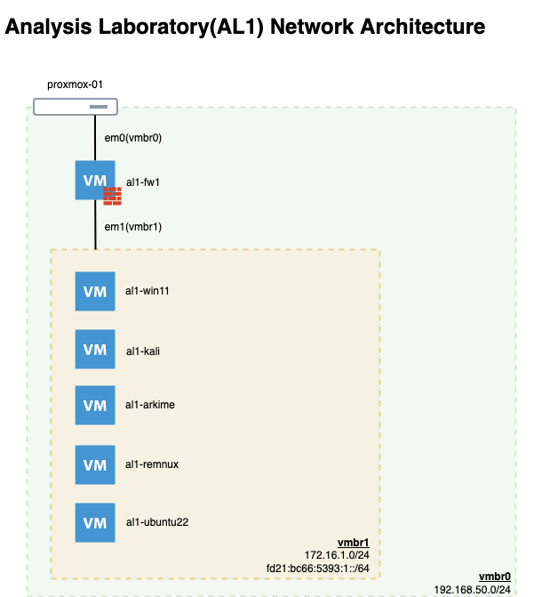

# Overview

## Analysis Lab

As part of work related to analyzing honeypot related artifacts this project
outlines the iterations of each labratory build. Network diagrams as well as
ansible playbooks are provided to allow others to build their lab as well.
This ensures that rebuilds and consistancy can be maintained in a reproducable
manor.

This lab currently uses a seperate machine with [proxmox](https://www.proxmox.com/en/) 
installed. Reference figure 1.0 below.

## Getting Started

1. Add new bridge network in proxmox
  - Name: vmbr1
  - IPv4/CIDR: 172.16.1.0/24
  - IPv6/CIDR: fd21:bc66:5393:1::/64 (see [https://cd34.com/rfc4193/](https://cd34.com/rfc4193)) 
  - Comment: "Analysis Lab 1"

2. Build OpenBSD host in proxmox.(Will be firewall, dhcpd, and dns)
  - 1GB memory
  - 1 socket, 1 core
  - 50G storage space
  - (2) interfaces, em0(vmbr0), em1(vmbr1)

3. Login to fw1 and add git
   ``pkg_add git``

4. Checkout the waxedhexagon repository on fw1 machine.
    ``git clone https://github.com/stevescally/WaxedHexagon.git``

5. Update the inventory.yaml file to reflect your network settings.
  - hardware / mac addresses
  - IP network ranges and subnets
  - Domain names, although home.arpa should work. [RFC8375](https://datatracker.ietf.org/doc/html/rfc8375)

6. Run the [openbsd_control_node.ksh](/ansible/utils/openbsd_control_node.ksh) script to configure the remaining base utilies. 
   - ``cd WaxedHexagon/ansible/utils/``
   - ``./openbsd_control_node.ksh``

## Resource

* http://www.threatlocus.com
